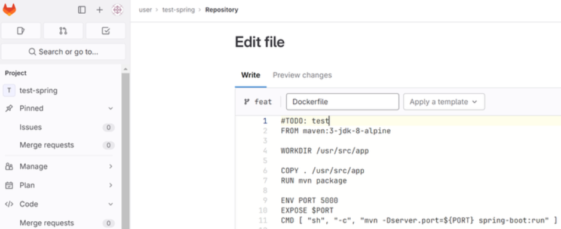
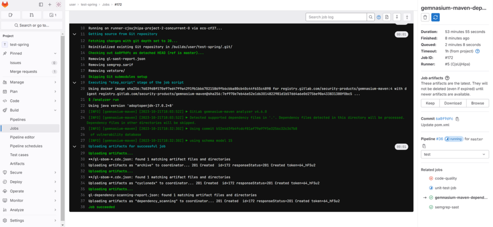

# 实现具有一定DevOps特性的GitLab流水线

> 助教撰写本手册时利用的是独立部署的在华为云上的GitLab企业版试用实例和服务器，但操作和南大Git基本是完全相同的。

## 运行环境与变量表

安全相关问题是因为服务器之间存在相互SSH的情况。


本文档使用了 `变量表` 的形式来记录所涉及的变量。文中凡是出现 `${VAR}` 样式的标记，即此处需要按照填入你所在运行环境的对应的值。

| 变量名           | 解释                      |
| ---------------- | ------------------------- |
| GITLAB_SERVER_IP | GitLab 服务器的 IP        |
| RUNNER_SERVER_IP | GitLab runner 服务器的 IP |
| APP_SERVER_IP    | 部署服务器 IP             |
| GITLAB_ROOT_PWD  | GitLab root用户密码       |
| GITLAB_USER_PWD  | GitLab user用户密码       |
| APP_SERVER_PWD   | 部署服务器 SSH 密码       |

## 示例项目前后端功能


此处用于演示的前后端功能相当简单。后端可以存储一个字符串，而前端可以选择（1）获取当前服务器上该字符串内容；（2）更新服务器上该字符串。

## GitLab的安装与配置

此部分无关紧要。南京大学采购了最高级别授权的极狐GitLab。此处创建了一个user用户和admin用户（超级管理员）。

## 配置用于执行流水线的Runner

登录user用户后，创建项目。为简化过程，此处选择从模板创建。


此处我们使用了GitLab提供的默认Spring模板项目作为示例。


创建好项目后，开始正式配置 GitLab runner。


GitLab的tag功能十分强大。Tag 是将 Git 项目中特定的提交标记为版本的一种方式。Tag 能够用于标记发布的版本，以便于对代码的每个版本进行管理和追踪。


登录 GitLab runner 服务器 的SSH，按照 GitLab 说明执行对应指令，使得该机器安装GitLab runner相关运行环境并注册到GitLab。下方的 `${GITLAB_RUNNER_TOKEN}`请自行替换为你的环境中的实际值。

> 这里涉及一个对`S3`的下载访问。很显然，中国大陆的服务器上不一定能直接稳定下载到这个文件。可以考虑本地用某种办法下载这个文件后手动上传服务器。


```bash
# Download the binary for your system
sudo curl -L --output /usr/local/bin/gitlab-runner https://gitlab-runner-downloads.s3.amazonaws.com/latest/binaries/gitlab-runner-linux-amd64

# Give it permission to execute
sudo chmod +x /usr/local/bin/gitlab-runner

# Create a GitLab Runner user
sudo useradd --comment 'GitLab Runner' --create-home gitlab-runner --shell /bin/bash

# Install and run as a service
sudo gitlab-runner install --user=gitlab-runner --working-directory=/home/gitlab-runner
sudo gitlab-runner start

# Choose shell as executor
gitlab-runner register
  --url http://git.nju.edu.cn
  --token ${GITLAB_RUNNER_TOKEN}
  
# Register的Runner的类型请选择shell

reboot

# Remove this useless file
rm /home/gitlab-runner/.bash_logout

# See status
systemctl status gitlab-runner
```

> 警告：对于南大Git用户，请务必关闭共享Runner！否则后续可能出现大量奇怪的异常。

GitLab runner 服务器 上安装好GitLab runner后，返回到GitLab，配置并出发流水线构建，观察流水线是否可用。GitLab网页版本身提供可视化编辑的能力。此处使用了这样的方式。在当前阶段，模板每个阶段并不进行实际的打包构建等操作，仅执行基本的bash命令测试runner的可用性。

```yaml
stages:          # List of stages for jobs, and their order of execution
  - build
  - test
  - deploy

build-job:       # This job runs in the build stage, which runs first.
  stage: build
  script:
    - echo "Compiling the code..."
    - echo "Compile complete."

unit-test-job:   # This job runs in the test stage.
  stage: test    # It only starts when the job in the build stage completes successfully.
  script:
    - echo "Running unit tests... This will take about 60 seconds."
    - sleep 60
    - echo "Code coverage is 90%"

lint-test-job:   # This job also runs in the test stage.
  stage: test    # It can run at the same time as unit-test-job (in parallel).
  script:
    - echo "Linting code... This will take about 10 seconds."
    - sleep 10
    - echo "No lint issues found."

deploy-job:      # This job runs in the deploy stage.
  stage: deploy  # It only runs when *both* jobs in the test stage complete successfully.
  environment: production
  script:
    - echo "Deploying application..."
    - echo "Application successfully deployed."
```


接下来触发流水线运行。


观察流水线运行情况，如能运行通过，说明连接和执行都没问题。


由于后续的代码质量检查等阶段会涉及 Docker ，故 GitLab runner 服务器 上需要安装 Docker。

```bash
sudo apt-get update
sudo apt-get install ca-certificates curl gnupg
sudo install -m 0755 -d /etc/apt/keyrings
curl -fsSL https://download.docker.com/linux/ubuntu/gpg | sudo gpg --dearmor -o /etc/apt/keyrings/docker.gpg
sudo chmod a+r /etc/apt/keyrings/docker.gpg

# Add the repository to Apt sources:
echo \
  "deb [arch="$(dpkg --print-architecture)" signed-by=/etc/apt/keyrings/docker.gpg] https://download.docker.com/linux/ubuntu \
  "$(. /etc/os-release && echo "$VERSION_CODENAME")" stable" | \
  sudo tee /etc/apt/sources.list.d/docker.list > /dev/null
sudo apt-get update
sudo apt-get install docker-ce docker-ce-cli containerd.io docker-buildx-plugin docker-compose-plugin
usermod -a -G docker gitlab-runner
```

## 服务端项目示例

> 请查看 `demo-devsecops-spring`。

### 构建与测试

确定GitLab与Runner的连接没问题后，需要在 GitLab runner 服务器 上安装像 JDK 这样需要的依赖。

```bash
sudo apt install openjdk-8-jdk sshpass
```

修改配置文件以进行真正的构建和测试（Build 和 Test 可以修改为如下内容）。

```yaml
build-job:       # This job runs in the build stage, which runs first.
  stage: build
  script:
    - chmod +x mvnw
    - ./mvnw build
  artifacts:
    untracked: true
    
# ......

unit-test-job:   # This job runs in the test stage.
  stage: test    # It only starts when the job in the build stage completes successfully.
  script:
    - chmod +x mvnw
    - ./mvnw test
    
# ......
```

执行流水线。此时应该可以看到构建的 `build-job` 和 `unit-test-job` 顺利通过。点击 unit-test-job 可以看到如下画面。命令行输出会提示测试的执行情况。


### 代码质量检查

加入代码质量检查的相关代码。

```yaml
code-quality:
  stage: test
  image: docker:20.10.12
  allow_failure: false
  services:
    - name: 'docker:20.10.12-dind'
      command: ['--tls=false', '--host=tcp://0.0.0.0:2375']
  variables:
    DOCKER_DRIVER: overlay2
    DOCKER_CERT_PATH: ""
    DOCKER_TLS_CERTDIR: ""
    DOCKER_TLS_VERIFY: ""
    CODE_QUALITY_IMAGE_TAG: "0.96.0"
    CODE_QUALITY_IMAGE: "$CI_TEMPLATE_REGISTRY_HOST/gitlab-org/ci-cd/codequality:$CODE_QUALITY_IMAGE_TAG"
    DOCKER_SOCKET_PATH: /var/run/docker.sock
  needs: []
  script:
    - export SOURCE_CODE=$PWD
    - |
      if ! docker info &>/dev/null; then
        if [ -z "$DOCKER_HOST" ] && [ -n "$KUBERNETES_PORT" ]; then
          export DOCKER_HOST='tcp://localhost:2375'
        fi
      fi
    - | # this is required to avoid undesirable reset of Docker image ENV variables being set on build stage
      function propagate_env_vars() {
        CURRENT_ENV=$(printenv)

        for VAR_NAME; do
          echo $CURRENT_ENV | grep "${VAR_NAME}=" > /dev/null && echo "--env $VAR_NAME "
        done
      }
    - |
      if [ -n "$CODECLIMATE_REGISTRY_USERNAME" ] && [ -n "$CODECLIMATE_REGISTRY_PASSWORD" ] && [ -n "$CODECLIMATE_PREFIX" ]; then
        CODECLIMATE_REGISTRY=${CODECLIMATE_PREFIX%%/*}
        docker login "$CODECLIMATE_REGISTRY" --username "$CODECLIMATE_REGISTRY_USERNAME" --password "$CODECLIMATE_REGISTRY_PASSWORD"
      fi
    - docker pull --quiet "$CODE_QUALITY_IMAGE"
    - |
      docker run --rm \
        $(propagate_env_vars \
          SOURCE_CODE \
          TIMEOUT_SECONDS \
          CODECLIMATE_DEBUG \
          CODECLIMATE_DEV \
          REPORT_STDOUT \
          REPORT_FORMAT \
          ENGINE_MEMORY_LIMIT_BYTES \
          CODECLIMATE_PREFIX \
          CODECLIMATE_REGISTRY_USERNAME \
          CODECLIMATE_REGISTRY_PASSWORD \
          DOCKER_SOCKET_PATH \
        ) \
        --volume "$PWD":/code \
        --volume "$DOCKER_SOCKET_PATH":/var/run/docker.sock \
        "$CODE_QUALITY_IMAGE" /code
    - cat gl-code-quality-report.json
    - |
      if grep "issue" gl-code-quality-report.json
      then
        echo "Test fail"
        exit 1
      else
        echo "Test success"
        exit 0
      fi
  artifacts:
    reports:
      codequality: gl-code-quality-report.json
    paths:
      - gl-code-quality-report.json
    expire_in: 1 week
  dependencies: []
  rules:
    - if: '$CODE_QUALITY_DISABLED'
      when: never
    - if: '$CI_COMMIT_TAG || $CI_COMMIT_BRANCH'
```

此时流水线由于代码门禁会 fail。


此时流水线情况应如下图所示。


可以在该页面的 Code Quality 标签处查看问题所在。


编辑 `mvnw` 文件，删除第 117 行处的 TODO 注释，并提交更改。


此时 pipeline 会自动重新执行，并成功通过。此时的 code-quality 步骤输出如下。


此时的流水线执行情况如下。


### 代码质量门禁

接下来将展示在分支合并时代码质量检查门禁的作用。

首先，从 master 分支创建一个分支 feat。


和随意编辑一个文件，加入注释 TODO。



创建一个合并请求。


在 Settings 中设置 `Pipelines must succeed` 。


在 `Merge Request` 的页面上可以看到 `Code Quality` 检测到 `issue` 并不能合并。


### 依赖检查与静态安全检查

进入项目的 `Settings - CI/CD`，类似第一次，使用如下指令再添加一个 Docker Runner，标签设置为 `docker`，添加时 base 镜像输入 `gradle:8.4.0-jdk8`。注意，此处的Gradle可能和你自己的项目中的`gradle`配置或者是Java版本相冲突。请自行调整下面的配置文件直到适配。

```bash
gitlab-runner register --url "http://60.204.229.205/" --registration-token "${GITLAB_RUNNER_TOKEN}" --executor "docker"
```


在 Pipeline 开头添加如下内容。

```yaml
include:
  - template: SAST.gitlab-ci.yml
  - template: Dependency-Scanning.gitlab-ci.yml

gemnasium-maven-dependency_scanning:  # 依赖检查
  tags: [ docker ]

semgrep-sast:  # 静态安全检查
  tags: [ docker ]
```

Commit 之后即可执行依赖检查和静态安全检查。

依赖检查输出如下。



静态安全检查输出如下。


### 部署

在 **部署服务器** 事先在上面安装 JDK。此步骤和配置runner时的情形是一致的。

本手册示例时服务端使用了裸机部署的方式，建议同学们在实际部署时以我们提供好的 `Dockerfile` 为蓝本使用Docker进行部署，和网页端示例项目那样。

准备好该机器的 IP、用户名和密码。

将原本的空 deploy 任务修改如下。

```bash
deploy-job:      # This job runs in the deploy stage.
  stage: deploy  # It only runs when *both* jobs in the test stage complete successfully.
  environment: production
  script:
    - sshpass -p "${APP_SERVER_PWD}" scp -o StrictHostKeyChecking=no target/demo-0.0.1-SNAPSHOT.jar root@${APP_SERVER_IP}:~
    - sshpass -p "${APP_SERVER_PWD}" ssh -o StrictHostKeyChecking=no root@${APP_SERVER_IP} "killall java; screen -d -m java -jar demo-0.0.1-SNAPSHOT.jar"
```

将 Spring 程序修改如下，增加一个两个示例接口。

```java
package com.example.demo;

import org.springframework.boot.*;
import org.springframework.boot.autoconfigure.*;
import org.springframework.web.bind.annotation.*;

@SpringBootApplication
@RestController
public class DemoApplication {

        String message = "Haven't received a message yet.";

        @GetMapping("/")
        String home() {
                return "Spring is here!";
        }

        @GetMapping("/api/message")
        String getMsg() {
                return message;
        }

        @PostMapping("/api/message")
        String saveMsg(@RequestBody String body) {
                message = body;
                return "OK";
        }

        public static void main(String[] args) {
                SpringApplication.run(DemoApplication.class, args);
        }
}
```

此时可以在 8080 端口上访问到部署的服务。

## 网页端项目示例

> 请查看 `demo-devsecops-vue`。

### 构建

同后端，修改为前端构建指令。具体指令和项目有关。

```bash
build-job:       # This job runs in the build stage, which runs first.
  stage: build
  script:
    - docker build -t demo/front .
    - docker save demo/front -o demo.tar
  artifacts:
    untracked: true
```

### 代码质量检查

类似后端，具体内容如下。

```yaml
code-quality:
  stage: test
  image: docker:20.10.12
  allow_failure: false
  services:
    - name: 'docker:20.10.12-dind'
      command: ['--tls=false', '--host=tcp://0.0.0.0:2375']
  variables:
    DOCKER_DRIVER: overlay2
    DOCKER_CERT_PATH: ""
    DOCKER_TLS_CERTDIR: ""
    DOCKER_TLS_VERIFY: ""
    CODE_QUALITY_IMAGE_TAG: "0.96.0"
    CODE_QUALITY_IMAGE: "$CI_TEMPLATE_REGISTRY_HOST/gitlab-org/ci-cd/codequality:$CODE_QUALITY_IMAGE_TAG"
    DOCKER_SOCKET_PATH: /var/run/docker.sock
  needs: []
  script:
    - export SOURCE_CODE=$PWD
    - |
      if ! docker info &>/dev/null; then
        if [ -z "$DOCKER_HOST" ] && [ -n "$KUBERNETES_PORT" ]; then
          export DOCKER_HOST='tcp://localhost:2375'
        fi
      fi
    - | # this is required to avoid undesirable reset of Docker image ENV variables being set on build stage
      function propagate_env_vars() {
        CURRENT_ENV=$(printenv)

        for VAR_NAME; do
          echo $CURRENT_ENV | grep "${VAR_NAME}=" > /dev/null && echo "--env $VAR_NAME "
        done
      }
    - |
      if [ -n "$CODECLIMATE_REGISTRY_USERNAME" ] && [ -n "$CODECLIMATE_REGISTRY_PASSWORD" ] && [ -n "$CODECLIMATE_PREFIX" ]; then
        CODECLIMATE_REGISTRY=${CODECLIMATE_PREFIX%%/*}
        docker login "$CODECLIMATE_REGISTRY" --username "$CODECLIMATE_REGISTRY_USERNAME" --password "$CODECLIMATE_REGISTRY_PASSWORD"
      fi
    - docker pull --quiet "$CODE_QUALITY_IMAGE"
    - |
      docker run --rm \
        $(propagate_env_vars \
          SOURCE_CODE \
          TIMEOUT_SECONDS \
          CODECLIMATE_DEBUG \
          CODECLIMATE_DEV \
          REPORT_STDOUT \
          REPORT_FORMAT \
          ENGINE_MEMORY_LIMIT_BYTES \
          CODECLIMATE_PREFIX \
          CODECLIMATE_REGISTRY_USERNAME \
          CODECLIMATE_REGISTRY_PASSWORD \
          DOCKER_SOCKET_PATH \
        ) \
        --volume "$PWD":/code \
        --volume "$DOCKER_SOCKET_PATH":/var/run/docker.sock \
        "$CODE_QUALITY_IMAGE" /code
    - cat gl-code-quality-report.json
    - |
      if grep "issue" gl-code-quality-report.json
      then
        echo "Test fail"
        exit 1
      else
        echo "Test success"
        exit 0
      fi
  artifacts:
    reports:
      codequality: gl-code-quality-report.json
    paths:
      - gl-code-quality-report.json
    expire_in: 1 week
  dependencies: []
  rules:
    - if: '$CODE_QUALITY_DISABLED'
      when: never
    - if: '$CI_COMMIT_TAG || $CI_COMMIT_BRANCH'
```

### 自动代码格式化

Git Hook 是 Git 的一项重要功能，旨在提供在版本管理系统中特定事件发生时执行可自定义的脚本。此处一个很常见的场景举例：自动代码格式化。

我们希望进入仓库的代码都是以统一的标准格式化的，由此，我们希望在产生和接收commit时进行额外的判断。

#### 服务端校验是否已格式化

此部分要求必须拥有GitLab的管理员权限。显然学生们不可能拿到南大Git的超级管理员权限。此部分不在作业要求中。

设置 hook：先退出当前用户，使用一开始的 root 用户登录，访问 `http://${你的服务器IP}/admin`，进入 `Overview - Projects - 你的项目`，复制 Relative path 。


如 **`@hashed/d4/73/d4735e3a265e16eee03f59718b9b5d03019c07d8b6c51f90da3a666eec13ab35.git`**

在 GitLab 运行的服务器上运行 `cd /var/opt/gitlab/git-data/repositories/`**`@hashed/d4/73/d4735e3a265e16eee03f59718b9b5d03019c07d8b6c51f90da3a666eec13ab35.git`**

随后执行以下命令。

```shell
mkdir custom_hooks
touch pre-receive
chmod 755 pre-receive
vim pre-receive
```

在 pre-receive 中写入以下内容。

```shell
echo "Hello World!"
exit 1
```

设置完毕，重新登陆回 user 用户，此时发现无法 commit 。


Pre-receive 脚本以非 0 值退出，该次 push 则被拒绝。

在前端项目的 pre-receive Hook 中写入以下内容，需要自行安装 prettier 软件包。注意，此时服务端需要使用 Node 16以上版本。安装 Node 16以上版本可以参考 https://github.com/nodesource/distributions 。

```shell
#!/bin/bash

echo "HELLO FROM HOOKS!"

ref_name=$1
new_rev=$3

my_work_tree=$(mktemp -d -t git-work-tree.XXXXXXXX)
git --work-tree="${my_work_tree}" --git-dir="." checkout $new_rev -f

echo "Checking code formatting..."
pushd ${my_work_tree} >/dev/null
prettier './**/*.{js,css,html,json,md}' --list-different
my_status=$?
popd >/dev/null

git --work-tree="${my_work_tree}" --git-dir="." checkout master -f >/dev/null
rm -rf "${my_work_tree}"

if [ "0" != "$my_status" ]; then
  echo "Please format the files listed above and re-commit."
  echo "(and don't forget your .prettierrc, if you have one)"
  exit 1
fi

```

则没有正确格式化的代码将被拒绝提交。

#### 客户端commit时自动格式化

请注意，官方文档 https://prettier.io/docs/en/precommit.html 的实现需要 Node 16 以上版本。

助教的项目要求使用Node 14.18.3。助教实现代码自动格式化时，是先按照 Option4 进行操作，而后手动修改 pre-commit 引入和 Option5 类似的代码实现的。实测该脚本在Windows下可以用。使用Node 16 + 时，可以试用 Option1这样更优雅的实现。详情请具体参考 前端参考项目中的实现。对于新克隆了本项目的用户，只要正确安装了 Node 14以上版本，并手动安装 prettier 后，便可以将实现代码提交前自动格式化。

```shell
npm install -g prettier
```

助教实现的版本中，husky对应的`precommit`内容如下。

```shell
#!/bin/bash

echo "Checking code formatting..."

FILES=$(git diff --cached --name-only --diff-filter=ACMR | sed 's| |\\ |g')
[ -z "$FILES" ] && exit 0

# Prettify all selected files
echo "$FILES" | xargs prettier '*.{js,css,html,json,vue,md}' --list-different --ignore-unknown --write

# Add back the modified/prettified files to staging
echo "$FILES" | xargs git add

exit 0
```

实际执行时，可以看到这样的输出。

```powershell
(base) PS F:\NJU\2023-Fall\DevOps\demoCode\demo-devsecops-vue> git commit -m "doc: 更新README"
Checking code formatting...
README.md
[main ef691b1] doc: 更新README
 1 file changed, 21 insertions(+), 9 deletions(-)
 rewrite README.md (98%)
(base) PS F:\NJU\2023-Fall\DevOps\demoCode\demo-devsecops-vue> git push
Enter passphrase for key '/c/Users/ydjsir/.ssh/id_rsa':
Enter passphrase for key '/c/Users/ydjsir/.ssh/id_rsa':
Enumerating objects: 5, done.
Counting objects: 100% (5/5), done.
Delta compression using up to 8 threads
Compressing objects: 100% (3/3), done.
Writing objects: 100% (3/3), 746 bytes | 746.00 KiB/s, done.
Total 3 (delta 1), reused 0 (delta 0), pack-reused 0
To git.nju.edu.cn:ydjsir/demo-devsecops-vue.git
   312676a..ef691b1  main -> main
(base) PS F:\NJU\2023-Fall\DevOps\demoCode\demo-devsecops-vue>
```

### 静态安全检查与依赖检查

除了名字（具体使用的工具）修改，同后端，具体内容如下。

```yaml
include:
  - template: SAST.gitlab-ci.yml
  - template: Dependency-Scanning.gitlab-ci.yml

nodejs-scan-sast:
  tags: [ docker ]

semgrep-sast:
  tags: [ docker ]
  
gemnasium-dependency_scanning:
  tags: [ docker ]
```

### 部署

在 **部署服务器** 上安装 Docker，上面有过类似步骤，此处不再赘述。

相关的流水线配置如下，此处使用了 Docker 进行部署，指令略有不同，但原理是相似的。

```yaml
deploy-job:      # This job runs in the deploy stage.
  stage: deploy  # It only runs when *both* jobs in the test stage complete successfully.
  environment: production
  script:
    - sshpass -p "${APP_SERVER_PWD}" scp -o StrictHostKeyChecking=no demo.tar root@122.9.67.46:~
    - sshpass -p "${APP_SERVER_PWD}" ssh -o StrictHostKeyChecking=no root@122.9.67.46 'docker container rm -f demo; docker load -i demo.tar; docker run -d --name demo -p 80:80 demo/front /bin/bash -c "nginx; tail -f /dev/null"'
```

