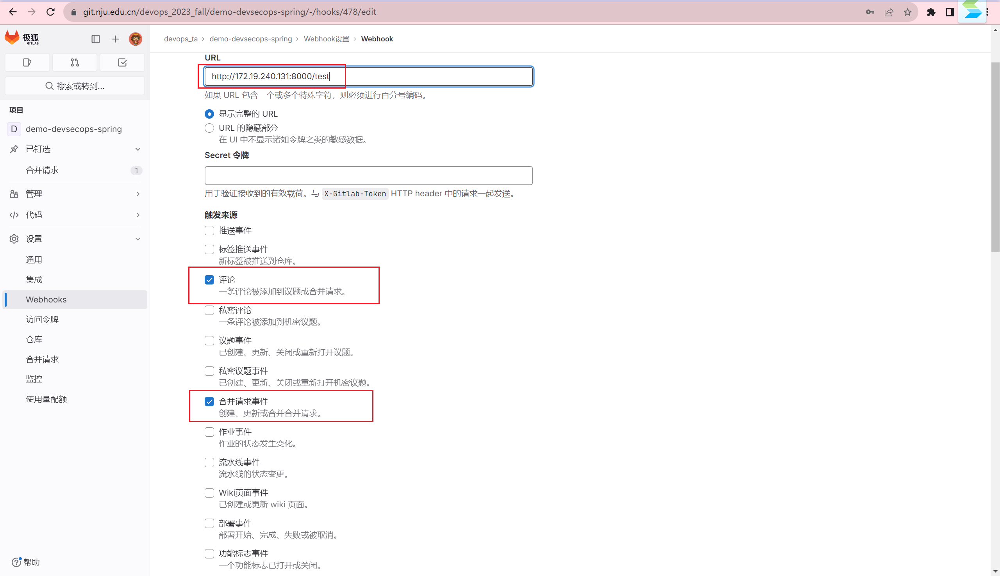

# GitLab PR集成LLM能力

> 请查看 `demo-gitlabllm-bot`仓库。

## 环境准备

### 环境说明

本手册实验的云主机操作系统版本为 `Ubuntu 18.04` ，请大家同样选择此版本，不然会出现构建好的语法树分析库无法执行的情况（经过测试，`Ubuntu 20.04`和`Ubuntu 22.04`也可用，但`Windows`一定不行）。对于服务器端开发本手册使用`python3.6.9` ，编写示例代码的助教并不熟悉`python`，相信大家可以写出比本手册示例更加优雅的代码。本手册参考文档为gitlab官方文档:https://docs.gitlab.com/ee/。由于每个人云主机环境与编程风格不同，调试过程可能有所区别，此手册示例代码仅供参考。

本次实验不需要对此前的流水线进行改动。由于教程都是按照Java代码设计的，因此请选择后端项目作为示例。也可以新建新的Java项目，但该Java项目必须是一个完整的后端项目。本次作业完全不考察对应Java项目的功能属性，而仅仅着眼于本手册体积的内容。

**请注意，助教提供的所有演示均着眼于展示可行性，不保证符合评分要求。最终完成度请严格根据评分标准执行。**

### 前置知识与变量表

本次实验需要大家熟悉gitlab的部分api接口，所使用接口部分重要参数说明如下，请大家在后续阅读中随时查阅，接口的具体使用将在后续步骤中详述。

| 参数名              | 解释                                                         | 来源                                  |
| ------------------- | ------------------------------------------------------------ | ------------------------------------- |
| {token}             | 令牌，在每次访问gitlab api时都要在headers中添加此字段作为身份验证标识。此手册中的{token}包括开发仓库令牌和文档仓库令牌，请注意区分 | 参考 1                                |
| {merge_request_iid} | `merge_request`的id                                          | Webhook payload                       |
| {project_id}        | `项目仓库`的id                                               | Webhook payload                       |
| {discussion_id}     | `new merge request thread`(即属于同一个`diffNote`的所有评论)的id，`diffNote`是`diff`第一个评论，见 5.2 | Webhook payload                       |
| {file_diff}         | 详见2.1.1中的解析                                            | `List-merge-request-diffs`接口        |
| {single_diff}       | 详见2.1.2中的解析                                            | `file-diff`字符串分离                 |
| {new_line}          | 更改后的行号，用于评论推送定位，详见5解析                    | `single-diff`字符串计算               |
| {old_line}          | 更改前的行号，用于评论推送定位，详见5解析                    | `single-diff`字符串计算               |
| {origin_version}    | 源分支(改变后的分支)                                         | Webhook payload                       |
| {target_version}    | 目标分支（没有改变的分支）                                   | Webhook payload                       |
| {new_path}          | 改变后的文件相对路径                                         | `List-merge-request-diffs`接口        |
| {old_path}          | 改变前的文件相对路径                                         | `List-merge-request-diffs`接口        |
| {description}       | 注意 5 中的 `description`和 7 中的 `description`是不同内容，5 中为 merge发起时的描述，7 中 为`diffNote`评论内容 | Webhook payload                       |
| {`server_ip`}       | 部署webhook的服务器ip                                        |                                       |
| {commit-sha}        | 唯一的标识一个提交                                           | `Get merge request diff versions`接口 |

此外除了手册内容外，示例代码中也保留了一些助教调试代码时的注释，有问题时不妨先看看。

## 实现Merge Request Hook

###  设置项目访问令牌`{token}`

在项目仓库页面侧边栏`设置`-`访问令牌`-`添加新令牌`


在添加新令牌页设置令牌信息，创建项目访问令牌，令牌名称将为后续`merge评论页`服务器评论的评论人名称


在创建成功的回调页中复制此令牌内容保存在本地，令牌内容为`{token}`，请大家此时记得保存令牌，否则关闭页面后将不可见


### 1.2 编写`webhook.py`并部署

webhook是开发者自定义的HTTP回调，通常由事件触发，例如将代码推送到存储库或对问题发表评论。当事件发生时，源应用会向为webhook配置的URI发出HTTP请求。

 本次实验中我们主要使用`webhook events`中的`Merge request event`和`Comment event`，两者将在用户`发起合并请求`和`提交评论`时触发，可以由`webhook payload` 中`event_type` 区分事件类型(`webhook payload` 详细参数可以在上面的官方文档链接中查看)。`webhook.py`示例代码如下：

```Python
from fastapi import FastAPI,Request

app = FastAPI()

# 发起merge和comment时的webhook
@app.post("/test")
async def receive_webhook(request: Request):
    data = await request.json()

    print("Received webhook data:")
    print(data)

    if data["object_kind"] == 'merge_request':
        # 实现 merge_request 相关操作的代码

    if data["object_kind"] == 'note':
        # 实现 note 相关操作的代码

    return {"status": "ok"}
```

登录云主机，将`webhook.py`传输至云主机任意路径，在`webhook.py`当前目录下输入

```Bash
pip3 install fastapi
pip3 install uvicorn==0.16.0
python3 -m uvicorn webhook:app  --host 0.0.0.0 --port 8000
```

上述命令将安装所需模块并在`8000`端口启动监听服务器，当关闭云主机客户端时该服务器也会关闭。

打开gitlab中你的项目并点击侧边栏`设置-Webhooks`


在`webhook设置页`添加新的webhook，在URL栏输入`{server_ip}:8000/test`(请注意这里的路径需要和`webhook.py` 中 `@app.post("/test")`中路径一样)，勾选触发来源中的`评论`和`合并请求事件`,勾选`SSL验证`，添加新的webhook，添加完成后即可点击`测试`测试评论事件



### 1.3 提交分支并开启`合并请求`，测试webhook

 在本地打开你的项目，创建新分支并修改新分支，提交到gitlab。这里请不要修改原来的分支，否则将引起冲突对后续大模型判断PR造成影响。在侧边栏中点击`合并请求`，在`合并请求`页中点击`新建合并请求`将源分支合并到目标分支。


此时云主机客户端将打印结果。


## 实现Code diff计算与PR规模限制 

本手册提供的Code diff计算限于已有函数内改变的情况，对于增减文件，增减函数的情况本手册尚未实现；请尽量一个函数改多行，改动的函数之间有一些行距或在不同的文件，防止`single-diff`将多个改动的函数包括在内导致报错；`single-diff`的内容是改动的行 + 改动的部分上下三行左右，所以请尽量修改长一些的函数，修改的部分不要在末尾，防止`single-diff`将函数外的部分提交语法树解析器；上述情况均会报`function not found`的错误(也可针对此错误做异常处理)。

### 2.1 获取`single-diff`和其所属函数的映射关系列表

#### 2.1.1 获取merge过程中的所有`file-diff`

从`web_hook payload`中，我们可以从`data["project"]["id"]`字段获取`{project_id}` ,从`data["object_attributes"]["iid"]`字段获取`{merge_request_iid}`。通过这俩个参数我们可以由`List-merge-request-diffs`(https://docs.gitlab.com/ee/api/merge_requests.html#list-merge-request-diffs)获取该次提交所有的diff字符串。

`List-merge-request-diffs`接口示例代码如下：

```Python
# 获取某次merge的所有diff
def api_merge_diff(project_id, merge_request_iid):
    response = requests.get(
        f"https://git.nju.edu.cn/api/v4/projects/{project_id}/merge_requests/{merge_request_iid}/diffs",
        headers={
        "PRIVATE-TOKEN": {token}
    })

    if response.status_code == 200:
        return json.loads(response.content)
    else:
        # 报错还没有处理
        print(f'get——merge——diff API请求失败：{response.status_code} {response.reason}')
        return None
```

`List-merge-request-diffs`接口示例返回(`response.content`)如下：

```JSON
[
    {
        "diff": "@@ -29,10 +29,6 @@ static class textHandler {\n
                 final List<String> keyphrase = extractor.getKeyphraseFromString(text);\n         double c_time = (System.nanoTime() - s_time)/1E9;\n \n-        final Map<String, Object> map = new HashMap<>();\n-        DecimalFormat df = new DecimalFormat(\"0.00000\");\n-        map.put(\"took\", Float.valueOf(df.format(c_time)));\n-\n         //response the request\n         response(0, map);\n     }\n@@ -44,6 +40,8 @@ static class textHandler {\n         if ( text == null || \"\".equals(text) ) {\n             response(STATUS_INVALID_ARGS, \"Invalid Arguments\");\n             return;\n+            response(STATUS_INVALID_ARGS, \"Invalid Arguments\");\n+            response(STATUS_INVALID_ARGS, \"Invalid Arguments\");\n         }\n \n         final JcsegGlobalResource resourcePool = (JcsegGlobalResource)globalResource;\n@@ -62,7 +60,7 @@ static class textHandler {\n         double c_time = (System.nanoTime() - s_time)/1E9;\n \n         final Map<String, Object> map = new HashMap<>();\n-        final DecimalFormat df = new DecimalFormat(\"0.00000\");\n+        final DecimalFormat\n         map.put(\"took\", Float.valueOf(df.format(c_time)));\n         map.put(\"sentence\", sentence);\n \n",
        "new_path": "src/main/java/com/example/demo/handler/textHandler.java",
        "old_path": "src/main/java/com/example/demo/handler/textHandler.java",
        "a_mode": "100644",
        "b_mode": "100644",
        "new_file": false,
        "renamed_file": false,
        "deleted_file": false
    },
    {
        "diff": "@@ -17,7 +17,7 @@ public class DemoApplication {\n \t\tfor (Integer i:demo) {\n \t\t\tSystem.out.println(demo);\n \t\t}\n-\t\treturn \"last is compele lats use a simple one!\";\n+\t\treturn\n \t}\n \t//this is just a test\n \n",
        "new_path": "src/main/java/com/example/demo/DemoApplication.java",
        "old_path": "src/main/java/com/example/demo/DemoApplication.java",
        "a_mode": "100644",
        "b_mode": "100644",
        "new_file": false,
        "renamed_file": false,
        "deleted_file": false
    }
]
```

`response.content`为一个对象数组，merge时发生更改的一个文件信息为数组中一个对象元素，对象中的`diff`属性值为所更改文件所有的更改区域的合集字符串，每个更改的区域由`@@ -\d+,\d+ \+\d+,\d+ @@`区分。我们这里称上述`diff`为一个文件的`file-diff`,`file-diff`示例如下

```JSON
@@ -6,7 +6,7 @@ static class textHandler {
         String text = getString("");
         int number = getInt("number", 10),
                 maxCombineLength = getInt("maxCombineLength", 4),
-                autoMinLength = getInt("autoMinLength", 4);
+                autoMinLength = getInt();
         if ( text == null || "".equals(text) ) {
             response(STATUS, "Invalid Arguments");
             return;
@@ -31,7 +31,7 @@ static class textHandler {
 
         final Map<String, Object> map = new HashMap<>();
         DecimalFormat df = new DecimalFormat("0.00000");
-        map.put("took", Float.valueOf(df.format(c_time)));
+        map.put("took");
 
         //response the request
         response(0, map);
```

#### 2.1.2 分离`file-diff`至多个`single-diff`

由于后续输入语法树解析器提取函数时每次输入一个文件内的一个改变区域，所以我们这里要将每个文件的`file-diff`分离为独立的单个区域的`single-diff`。分离示例代码如下：

```Python
"""
因为 List merge request diffs 返回一个文件的所有diff,有碍于根据单个diff查找上下文，故这里要对diff进行切分 (可能写烦了，是不是可以直接一个正则出结果)
输入参数：一个文件的diff
返回：一个文件的所有single-diff列表
"""
def get_single_diff(file_diff):
    result = []
    # 对字符串以@@ -num,num +num,num @@分割
    tmpList = re.split(r"(@@ -\d+,\d+ \+\d+,\d+ @@)", file_diff)
    array_iter = enumerate(tmpList)
    # 将分隔符和字符串连接
    for index,item in array_iter:
        if re.search(r"(@@ -\d+,\d+ \+\d+,\d+ @@)",item):
            print(tmpList[index] + tmpList[index + 1])
            result.append(tmpList[index] + tmpList[index + 1])
    return result
```

#### 2.1.3 获取发生改变的文件的全部内容并生成临时文件保存服务器

由于后续输入语法树解析器提取函数时需要输入更改的文件的全部内容，这里使用`Get-raw-file-from repository`(https://docs.gitlab.com/ee/api/repository_files.html#get-raw-file-from-repository)端口获取。

接口访问示例代码如下：

```Python
# 获取指定分支上文件内容
# 输入参数：project_id:略，file-path:文件路径，version：源分支(发生改变的分支)名
def api_file_content(project_id, file_path, version):
    response = requests.get(
        f'https://git.nju.edu.cn/api/v4/projects/{project_id}/repository/files/{encode_filpath(file_path)}/raw?ref={version}',
        headers={
            "PRIVATE-TOKEN": token
        })

    if response.status_code == 200:
        return response.text
    else:
        # 报错还没有处理
        print(f'get_file API请求失败：{response.status_code} {response.reason}')
        return None
```

输入参数中的`filepath`为发生改变的文件在源分支的路径名，其可以通过2.1.1中的`List-merge-request-diffs`获取。注意这里的`filepath`在实际传入时需要进行`URL`编码，编码函数如下：

```Python
"""
对文件路径进行URL编码
"""
def encode_filpath(file_path):
    encoded_file_path = urllib.parse.quote(file_path, safe='')
    return encoded_file_path
```

`Get-raw-file-from repository`的返回值为被更改的文件的全部内容，这里我们生成一个临时文件写入其中，其代码如下：

```Python
"""
获取gitlab中指定文件的内容并写入服务器临时文件，此方法包括2.1.3中api_file_content的调用

传入参数：同api_file_content
返回参数：生成的临时文件的绝对路径

"""


def get_gitlab_file_content(project_id, file_path, version):
    file_content = api_file_content(project_id, file_path, version)

    # 创建临时文件 什么时候删除呢？
    with tempfile.NamedTemporaryFile(suffix=get_suffix(file_path), delete=False) as temp_file:
        # 获取临时文件路径
        temp_file_path = temp_file.name

    # 写入文件内容
    with open(temp_file_path, 'w', encoding="utf-8") as file:
        file.write(file_content)

    return temp_file_path
```

#### 2.1.4 通过语法树解析器提取改变后的函数并去除同属一个函数的多个`single-diff`，构建映射关系列表

为了提升大模型评审效果，我们需要向大模型发送`single-diff`所在的函数；为了减轻大模型服务器压力，对于

多个`single-diff`属于同一个函数的情况只需要发送一次函数即可，故在使用语法树解析器提取函数的同时需要去重，这里的逻辑是一个函数保留函数中最后位置的`single-diff`即可，示例代码如下，改函数将返回一个列表`list[[改变后的函数，该函数中位置在最后的{single-diff]字符串]`：

```Python
"""
建立映射关系列表,此方法包括2.1.3 get_gitlab_file_content 的调用
输入参数：略
返回参数：[[改变后的函数，函数中最后一个{single-diff}]]
"""


def get_new_func(project_id, origin_version, file-diff, new_path):
    list = []
    result = get_single_diff(file-diff)
    # 如果只是新增没有修改呢，需要测试；如果修改的地方在不在函数中呢，需要测试；如果是新增新文件呢，需要测试
    origin_file_path = get_gitlab_file_content(project_id, new_path, origin_version)
    print('origin_file_path：' + origin_file_path)

    # manager可复用，可不可以用单例模式重构？FunctionManager在demo仓库中
    manager1 = FunctionManager(origin_file_path)

    # 去重，防止一个函数有多个diff，并且当同一个文件的single diff第一次进入时直接添加入list,减少新文件的遍历次数
    for item in result:
        if not list:
            func = manager1.get_function(item).decode()
            list.append([func, item])
            print("提取的函数在这里" + func)
        else:
            origin_tmp_function = manager1.get_function(item).decode()
            print("提取的函数在这里" + origin_tmp_function)
            flag = 0
            for i in list:
                if i[0] == origin_tmp_function:
                    i[1] = item
                    flag = 1
                    break
            if flag == 0:
                list.append([origin_tmp_function, item])
    print("除报错外所有函数提取成功！")
    return list
```

语法解析器代码(`FunctionManager`)在demo仓库中，这里不做解析。当该步完成后云主机客户端将打印：


### **2.2 PR规模限制**

碍于服务器性能这里我们需要对PR的一些规模做出限制，如只评审Java代码，规定发生改变的涉及的每个`single-diff`不超过10行等(自由发挥，合理即可)

> 单次PR涉及的函数代码的字节数不应超过8192。否则不会把相关信息发给大模型而是直接跳到第五步提示变更规模过大。检查时检查的是有无相关代码实现或展示一个被拒绝的示例。这是最基本要求。如果自行设计了其他标准，则展示其他标准的设计或示例。

```Python
"""
获得文件后缀
输入参数：文件相对路径即{new-path}
返回：后缀，如 '.java'
"""
def get_suffix(file_path):
    return os.path.splitext(os.path.basename(file_path))[1]
```

## 实现对大模型访问

在 2.1 中我们已经获得了`single-diff`和其所属函数的映射关系列表`list`，接下来我们需要将`list`中的函数发送给大模型进行评审。4 中的prompt由`{各自作业方向的prompt}+{函数}`组成，其中函数在`list`中，`各自作业方向的prompt`可以在`新建合并请求页`中的`描述`中发送


`描述`中的内容可以由 1 中的`webhook payload`中的``data["project"]["description"]`字段获取，下文中我们称之为`description`。对大模型访问示例代码如下：

```Python
def api_AI_post(content):
    params = {
        "model": "Qwen-14B",
        "temperature": 0.7,
        "messages": [{"role": "user", "content": content}],
        "max_tokens": 512,
        "stop": None,
        "n": 1,
        "top_p": 1.0,
    }
    response = requests.post("http://${LLM_SERVER_IP}:8000/v1/chat/completions", headers=headers, json=params)

    if response.status_code == 200:
        return json.loads(response.text).get("choices")[0].get("message").get("content")
    else:
        # 报错还没有处理
        print(f'AIpost_API请求失败：{response.status_code} {response.reason}')
        return None
```

调用模型接口与拼接prompt示例如下：

```Python
# 性能可能需要添加线程池异步处理，自由发挥 这里的post即为上述description，list上文已说明
for item in list:
    rs = api_AI_post(format(post) + '```待评审函数开始' + item[0] + '```待评审函数结束')
    print(rs)
```

模型反馈见4

## 构建符合任务需要的prompt

助教团队部署了来自阿里巴巴的通义千问，14B参数量版本的对话模型。由于我们使用的大模型训练的语料兼有中文和英文，故回复的结果可能是中文或英文。为保证统一性，要求prompt和回复必须是同一种语言。可以在prompt中加入对回复语言要求的限定。此要求仅对基础分部分严格生效，进行讨论时允许出现语言不同的情况。

如果使用的是自己的模型，仍需要遵循prompt和回复时使用的语言的一致性。

### 4.1 Code Review 方向示例

~~~Python
import requests
import time
prompt = """{Code Review的prompt}
```待评审函数开始
{}
```待评审函数结束
"""

func = """    @Test
    public void shouldBuildNativeImage() throws Exception {
        final File projectDir = getProjectDir("basic-java-native-module");

        final BuildResult build = runGradleWrapper(projectDir, "clean", "buildNative");

        assertThat(build.getTasks().get(":quarkusBuild")).isEqualTo(BuildResult.SUCCESS_OUTCOME);
        final String buildOutput = build.getOutput();
        // make sure the output log during the build contains some expected logs from the native-image process
        CharSequence[] expectedOutput = new CharSequence[] { "Initializing...", "Performing analysis...",
                "Finished generating '" + NATIVE_IMAGE_NAME + "' in" };
        assertThat(buildOutput)
                .withFailMessage("native-image build log is missing certain expected log messages: \n\n %s", buildOutput)
                .contains(expectedOutput);
        Path nativeImagePath = projectDir.toPath().resolve("build").resolve(NATIVE_IMAGE_NAME);
        assertThat(nativeImagePath).exists();
        Process nativeImageProcess = runNativeImage(nativeImagePath.toAbsolutePath().toString());
        try {
            final String response = devModeClient.getHttpResponse("/hello");
            assertThat(response)
                    .withFailMessage("Response %s for /hello was expected to contain the hello, but didn't", response)
                    .contains("hello");
        } finally {
            nativeImageProcess.destroy();
        }
    }"""

headers = {"Content-Type": "application/json"}
parms = {
    "model": "Qwen-14B",
    "temperature":0.2,
    "messages": [{"role": "user", "content": prompt.format(func)}],
    "max_tokens":512,
    "stop":None,
    "n": 1,
    "top_p": 0.95,
  }
t = time.time()

response = requests.post("http://${LLM_SERVER_IP}:8000/v1/chat/completions", headers=headers, json=parms)
print("补全模式输出："+response.text + f"cost {time.time()-t:.2f}s")
~~~

模型反馈如下。因为让大模型按Markdown格式返回，因此飞书文档里面默认就格式化好了。

> 1. **代码可读性**：函数名称`shouldBuildNativeImage`没有很好地描述函数的功能。建议将其更改为更具描述性的名称，例如`testNativeImageBuild`。
> 2. **代码可维护性**：在`runNativeImage`函数中，没有对`Process`对象的异常进行处理。这可能会导致程序在遇到错误时崩溃。建议添加适当的异常处理代码。
> 3. **代码效率**：在`runNativeImage`函数中，没有使用`try-with-resources`语句来确保`Process`对象在使用后被正确关闭。这可能会导致资源泄漏。建议使用`try-with-resources`语句。
> 4. **代码安全**：在`runNativeImage`函数中，没有对`devModeClient.getHttpResponse("/hello")`的响应进行验证。这可能会导致安全问题。建议添加适当的验证代码。
> 5. **代码结构**：函数`runGradleWrapper`和`runNativeImage`的职责不清晰。建议将它们分解为更小的函数，每个函数只负责一个特定的任务。
> 6. **代码风格**：函数中的注释没有遵循Java的代码风格指南。建议使用`//`而不是`/*`来开始单行注释，使用`/*`和`*/`来开始多行注释。

### 4.2 Code Summary 方向示例

~~~Python
import requests
import time

prompt = """{Code Summary的prompt}
```Java
{}
```
"""

func = """    @Test
    public void shouldBuildNativeImage() throws Exception {
        final File projectDir = getProjectDir("basic-java-native-module");

        final BuildResult build = runGradleWrapper(projectDir, "clean", "buildNative");

        assertThat(build.getTasks().get(":quarkusBuild")).isEqualTo(BuildResult.SUCCESS_OUTCOME);
        final String buildOutput = build.getOutput();
        // make sure the output log during the build contains some expected logs from the native-image process
        CharSequence[] expectedOutput = new CharSequence[] { "Initializing...", "Performing analysis...",
                "Finished generating '" + NATIVE_IMAGE_NAME + "' in" };
        assertThat(buildOutput)
                .withFailMessage("native-image build log is missing certain expected log messages: \n\n %s", buildOutput)
                .contains(expectedOutput);
        Path nativeImagePath = projectDir.toPath().resolve("build").resolve(NATIVE_IMAGE_NAME);
        assertThat(nativeImagePath).exists();
        Process nativeImageProcess = runNativeImage(nativeImagePath.toAbsolutePath().toString());
        try {
            final String response = devModeClient.getHttpResponse("/hello");
            assertThat(response)
                    .withFailMessage("Response %s for /hello was expected to contain the hello, but didn't", response)
                    .contains("hello");
        } finally {
            nativeImageProcess.destroy();
        }
    }"""

headers = {"Content-Type": "application/json"}
parms = {
    "model": "Qwen-14B",
    "temperature":0.2,
    "messages": [{"role": "user", "content": prompt.format(func)}],
    "max_tokens":512,
    "stop":None,
    "n": 1,
    "top_p": 0.95,
  }
t = time.time()

response = requests.post("http://${LLM_SERVER_IP}:8000/v1/chat/completions", headers=headers, json=parms)
print("补全模式输出："+response.text + f"cost {time.time()-t:.2f}s")
import json
print(json.loads(response.text)["choices"][0]["message"]["content"])
~~~

模型反馈如下。因为让大模型按Markdown格式返回，因此飞书文档里面默认就格式化好了。

> 这个函数的主要功能是使用Gradle构建一个Quarkus Native Image，并验证构建过程是否成功。如果构建成功，它还会运行一个名为`devModeClient`的客户端，该客户端向本地服务器发送一个HTTP请求，并验证响应是否包含预期的字符串。
>
> 输入：
>
> 这个函数的输入是一个名为`projectDir`的`File`对象，它代表项目的目录。这个目录应该包含一个名为`build.gradle`的文件，其中定义了如何使用Gradle构建项目。
>
> 返回值：
>
> 这个函数没有显式的返回值。但是，它会执行一些操作，如运行Gradle任务、验证构建输出、检查Native Image是否存在、运行Native Image进程、发送HTTP请求并验证响应等。这些操作的结果可以通过检查函数内部的变量或状态来获取。

## 将大模型结果反馈到Merge Request页面

此处你需要将上一步骤获得的大模型反馈返回到PR的评论区。**手册中不讨论返回的具体内容，仅展示如何把纯文本发送到PR评论区，因此两种选题不需要拆分单独讨论**。

### 5.1 获取反馈推送位置

将文本推送到merge评论页时，我们首先需要获取推送的准确行数。2.1中的`list`保存了`single-diff`字符串，`single-diff`字符串首行保留了文件增减行数的信息，故这里我们对其进行处理，其逻辑为：取`single-diff`中新增的最后一行，若没有新增就取减去的最后一行，示例代码如下：

```Python
"""
计算diffNote标识的行位置(可以改进的更加准确或换成多行)，这里的逻辑是取一段diff中新增的最后一行，若没有新增就取减去的最后一行，经测试在comment页中可以显示所有改diff涉及的行(大概)
输入参数：diff字符串
返回：[行位置，判断标识]判断标识的作用将在5.2详叙
"""
def get_diffNote_postion(single_diff):
    match = re.search(r"\+(\d+)\D+(\d+)", single_diff)
    first = int(match.group(1, 2)[0])
    seco = int(match.group(1, 2)[1])
    # 若 diff 头标识+号后第二个数字为6，代表没有新增；因为 diff 内容为改动部分+上下三行，6代表改动部分行数为0
    if seco == 6:
        match = re.search(r'-.*?(\d+)\D*(\d+)', single_diff)
        second_digit = int(match.group(2))
        first_digit = int(match.group(1))
        return [first_digit + second_digit - 4, 0]
    else:
        return [first + seco - 4, 1]
```

该代码返回推送评论的准确行位置和一个判断标识，判断标识的作用将在`5.2`详叙。

### 5.2 推送反馈信息

此处主要使用`Create-new-merge-request-thread`(https://docs.gitlab.com/ee/api/discussions.html#create-new-merge-request-thread)接口和`Get merge request diff versions`(https://docs.gitlab.com/ee/api/merge_requests.html#get-merge-request-diff-versions)接口。

`Get merge request diff versions`接口主要用于获取`commit-sha`值，其示例代码如下：

```Python
# 获取merge时的commit sha等以用作之后的diffNote discussion
def api_get_sha(project_id, merge_request_iid):
    response = requests.get(
        f'https://git.nju.edu.cn/api/v4/projects/{project_id}/merge_requests/{merge_request_iid}/versions',
        headers={
            "PRIVATE-TOKEN": token
        })

    if response.status_code == 200:
        return json.loads(response.content)[0]
    else:
        # 报错还没有处理
        print(f'sha API请求失败：{response.status_code} {response.reason}')
        return None
```

其反馈信息如下：

```Python
[
    {
        "id": 10880,
        "head_commit_sha": "45ce18fc5396fe0d9fa27ffdd4a9dd0cc51680a1",
        "base_commit_sha": "8ec63a83ea33b821b3f05d22a19c419a42444334",
        "start_commit_sha": "8ec63a83ea33b821b3f05d22a19c419a42444334",
        "created_at": "2023-11-20T23:57:45.518+08:00",
        "merge_request_id": 4164,
        "state": "collected",
        "real_size": "2",
        "patch_id_sha": "7fd182e18bd034164a376df151d1ef18496b0460"
    }
]
```

其反馈信息中`base_commit_sha`,`start_commit_sha`,`head_commit_sha`分别对应`Create-new-merge-request-thread`接口中的`base_sha,start_sha,head_sha`参数。`Create-new-merge-request-thread`接口实例如下：

```Python
# 推送到gitlab的diffNote discussion
# 此接口只支持单行diffNote discussion标识评论，但经测试显示内容已覆盖单次diff大部分内容
# 若想实现多行diffNote discussion标识评论请参考 https://docs.gitlab.com/ee/api/discussions.html#create-a-new-thread-in-the-merge-request-diff
def api_post_diffNote(project_id, merge_request_iid, base_sha, head_sha, start_sha, new_path, old_path, new_line,
                      old_line, content):
    # 为什么这里要先转化为json而不能直接使用dataForm的形式？和js比较呢？
    prama = {
        'body': content,
        'position': {
            'base_sha': base_sha,
            'head_sha': head_sha,
            'start_sha': start_sha,
            'position_type': 'text',
            'new_path': new_path,
            'old_path': old_path,
            'new_line': new_line,
            'old_line': old_line
        }
    }
    response = requests.post(
        f'https://git.nju.edu.cn/api/v4/projects/{project_id}/merge_requests/{merge_request_iid}/discussions',
        json.dumps(prama), headers={
            "PRIVATE-TOKEN": token,
            "Content-Type": "application/json"
        })

    if response.status_code == 201:
        # 救命啊为什么这里是个数组，为什么正确是201
        return response.content
    else:
        # 报错还没有处理
        print(f'post——diff API请求失败：{response.status_code} {response.content}')
        return None
```

`Create-new-merge-request-thread`接口用于向指定路径的指定行位置推送可以评论的评论。其参数中`new_line`标识更改后行位置，`old_line`标识更改前的行位置。经助教测试该接口当`new_line`和`old_line`有一个为空时成功推送`diffNote`，当两者都不空时推送位置助教无法确定，故助教这里的处理是：若`single-diff`中只有删去的行时令`new_line`为空，若`single-diff`只有新增的行或既有新增也有删除的行时令`old-line`为空(因为新增的行在评论页显示时在减去的行下方，当行数不大时若推送位置在新增行，其位置上方减去的行也在可视范围内),其判断标识已包括在5.1示例代码`get_diffNote_postion` 中。其调用`get_diffNote_postion`和推送评论的示例代码如下：

```Python
    # api_get_sha，api_post_diffNote在5.2中已阐述，api_AI_post在3中已阐述
    sha = api_get_sha(project_id, merge_iid)
    # 可能需要添加线程池异步处理
    for item in list:
        rs = api_AI_post(format(post) + '```待评审函数开始' + item[0] + '```待评审函数结束')
        flag = get_diffNote_postion(item[1])
        tmp = api_post_diffNote(project_id, merge_iid, sha.get("base_commit_sha"), sha.get("head_commit_sha"),
                        sha.get("start_commit_sha"), new_path, old_path, flag[0] if flag[1] == 1 else None,
                        flag[0] if flag[1] == 0 else None, 'from GenAI: \n' + rs)
```

其效果如下：


此处推送的内容我们称之为`diffNote`，下文均以此称呼。

这里的实现方式不只一种，大家可以自由实现，效果尚可即可。

## 6 Code Review方向 让大模型判断是否接受PR 

助教团队建议通过对prompt的修改，使得大模型能返回是否接受PR的结果（原先的Code Review内容当然不能被忽略），而后代码能通过正则表达式等手段提取大模型的反馈，并通过 GitLab API反馈到PR页面。这样的判断并不一定是正确的，也不一定要实现接受 / 拒绝两种情况。只要能演示 接受/拒绝两种情况 中的一种即可。但如果无视大模型的结果直接 接受 / 拒绝PR，则此步骤不得分。**手册中仅提供如何用GitLab API拒绝PR**。

拒绝PR的接口为`Update MR`(https://docs.gitlab.com/ee/api/merge_requests.html#update-mr)

```Python
"""
关闭merge的接口
官方文档为：https://docs.gitlab.com/ee/api/merge_requests.html#update-mr

输入参数：
    'id':The ID or URL-encoded path of the project owned by the authenticated user. 可以从merge_request的webhook中获取
    'merge_request_iid':  The internal ID of the merge request. 同上
     
返回参数：见官方文档
"""

def close_merge_request(proj_id, request_id):
    return requests.put(server + f"/projects/{proj_id}/merge_requests/{request_id}", headers={
           "PRIVATE-TOKEN": token,
           "Content-Type": "multipart/form-data"
           }, data={"state_event": "close"})
```

## Code Summary方向 大模型结果反馈到文档仓库

### 6.1 利用api向仓库推送commit

此步骤主要使用`Create a commit with multiple files and actions`(https://docs.gitlab.com/ee/api/commits.html#create-a-commit-with-multiple-files-and-actions)接口，其代码示例和参数信息整理如下。

> 如果你的文档仓库和代码仓库并非同一个，此api的使用请注意一下令牌之间的差异。项目令牌设置过程同1。

```Python
"""
提交内容至仓库
https://docs.gitlab.com/ee/api/commits.html#create-a-commit-with-multiple-files-and-actions

request_body如下
{
    "id":  # The ID or URL-encoded path of the project
    "branch": "master", # 要提交的分支
    "commit_message":"123456", # 提交信息
    "actions":[ # 提交内容，可提交多个文件
        {
            "action":"create", # 提交类型，这里是创建文件，其他内容见官方文档
            "file_path": "new_test.md", # 新建的文件路径
            "content":"123456" # 写入文件中的内容
        }
    ]   
}

返回参数：见官方文档
"""


def api_commit_post(id, branch, commit_message, action, file_path, content):
    params = {
        "branch": branch,
        "commit_message": commit_message,
        "actions": [
            {
                "action": action,
                "file_path": file_path,
                "content": content
            }
        ]
    }
    response = requests.post(f'https://git.nju.edu.cn/api/v4/projects/{id}/repository/commits', headers=headers, json=params)

    if response.status_code == 201:
        return json.loads(response.content)
    else:
        # 报错还没有处理
        print(f'get——merge——diff API请求失败：{response.status_code} {response.reason}')
        return None
```

其调用过程如下,除`Create a commit with multiple files and actions`调用外与5.2中的内容大致一致，若想显示文档地址在5.2的推送文本中加入即可:

```Python
for item in list:
    rs = api_AI_post(format(post) + '```待评审函数开始' + item[0] + '```待评审函数结束')
    flag = get_diffNote_postion(item[1])
    tmp2 = api_commit_post(project_id, target_version, "来自大模型的评审", 'create',
                       'comment' + str(flag[0]) + '.md',
                       '```待评审函数开始' + item[0] + '```待评审函数结束' + rs)
    # 同样的类型接口返回类似居然不一样，每次访问完要删除生成的文件
    tmp = api_post_diffNote(project_id, merge_iid, sha.get("base_commit_sha"), sha.get("head_commit_sha"),sha.get("start_commit_sha"), new_path, old_path, flag[0] if flag[1] == 1 else None,flag[0] if flag[1] == 0 else None, 'from GenAI: \n' + rs)
```

这里的示例代码生成的文件不是随机命名的，故在开关同一个`merge`时需要删除生成的文件。否则会报文本已存在的错误。若想多次调用改随机数或时间后缀命名即可。`上面的代码示例是推送到本仓库的，请注意如果想把文件推送到其他仓库需要更改commit接口的project_id和merge_iid；如果想向一个文件中更新多次需要先读再写，即先使用2.1.3中的get-file接口再使用上述commit接口，此时要把commit接口的action设置为update`

效果如下：（下图仅展示如何把文件放到南大Git上，具体格式请看6.2）


### 6.2 文档仓库格式要求

每一次PR都应该至少生成一个Markdown文件，该Markdown文件的一级标题为 PR-{PR编号}-{PR标题}，而后应包括本文档的生成时间（精确到分钟，具体格式不要求）和对应PR的地址。

> 上述所有参数都可以在 1 中的`webhook payload`中找到，同学们可以参考官方文档中的`payload`样例https://docs.gitlab.com/ee/user/project/integrations/webhook_events.html#merge-request-events

每一个包含diff的函数都应该体现在文档中。每一个函数应包含如下内容：

1. 所在的文件路径，从根目录开始；
2. 修改后的代码；
3. 大模型生成的Code Summary；

不要求对标题进行层级编号。


## Code Review方向 与大模型讨论Code Review

### 7.1 设置webhook

 如1，这里主要获取的是`note`类型的`payload`中的`data["project_id"],data["merge_request"]["iid"],data["object_attributes"]["discussion_id"],data["object_attributes"]["description"]`以调用7.3中的方法

 这里需要注意在7.3发送`diffNote`的评论的时候文本添加了`from GenAI`作为评论来自AI的标识，防止一直触发评论的webhook造成死循环。在 1 `webhook.py`中对于`note相关操作`的处理时需要添加下述方法判断评论的添加是否是来自AI的。

```Python
"""
判断webhook的输入是否来自AI，防止死循环
输入参数：来自diffNote的description，即webhook payload中data["object_attributes"]["description"]
返回参数：boolean，1代表来自AI不要处理，0代表来自人需要处理
"""
def match_string(string):
    pattern = r"from GenAI"
    if re.search(pattern, string):
        return 1
    else:
        return 0
```

### 7.2 建立[discussion_id -> prompt]缓存

在5.2调用`Create-new-merge-request-thread`接口后将返回添加的评论(即`diffNote`)的`discussion_id`，其对应上述接口返回字段中的`id`，对此`diffNote`的评论都可以以`discussion_id`为区分标志。为了实现上下文讨论，我们需要记录每次提问的内容至缓存，在下次提问时一起发送，其实现代码如下:

```Python
# --*-- conding:utf-8 --*--
# @Time : 2023/11/21 12:31
# @Author : HongZe
# @File : cache.py.py
# @Function:

# 用作[discussion_id -> prompt]的缓存，保存讨论状态
ca_list = []


# 添加缓存
def set_list(discussion_id, prompt):
    ca_list.append([discussion_id, prompt])


def get_prompt(discussion_id):
    for i in ca_list:
        if (i[0] == discussion_id):
            return i[1]
    return ""

# 根据discussion_id修改prompt
def set_list_byId(discussion_id , prompt):
    for i in ca_list:
        if i[0] == discussion_id:
            i[1] = prompt
            return 1
    return 0


def remove_prompt():
    ca_list.clear()
    return None
```

### 7.3. 发送至评论的评论

主要使用`Add note to existing snippet thread`(https://docs.gitlab.com/ee/api/discussions.html#add-note-to-existing-snippet-thread),其示例接口如下：

```Python
def api_add_existNote(project_id, merge_request_iid, discussion_id, content):
    prama = {
        'body': content
    }
    response = requests.post(
        f'https://git.nju.edu.cn/api/v4/projects/{project_id}/merge_requests/{merge_request_iid}/discussions/{discussion_id}/notes',
        json.dumps(prama), headers={
            "PRIVATE-TOKEN": token,
            "Content-Type": "application/json"
        })

    if response.status_code == 201:
        # 为什么正确是201
        return response.content
    else:
        # 报错还没有处理
        print(f'add_note API请求失败：{response.status_code} {response.content}')
        return None
```

其调用实例如下：

```Python
# --*-- conding:utf-8 --*--
# @Time : 2023/11/20 17:25
# @Author : HongZe
# @File : discussion_handler.py.py
# @Function: 关于dicussion的note讨论

"""
接受dicussion thread后续的回复并提交大模型，返回信息
"""
from api.api import api_add_existNote, api_AI_post
from service.cache import get_prompt, set_list_byId


def post_discussion_note(project_id, merge_request_iid, discussion_id, content):
    # 向缓存添加每次问答的问题
    new_content = get_prompt(discussion_id) + '\n' + format(content)
    print('这里的提问是' + new_content)
    set_list_byId(discussion_id, new_content)
    # 向大模型发起提问并将答案推送到评论页
    api_add_existNote(project_id, merge_request_iid, discussion_id, "from GenAI: \n" + api_AI_post(new_content))

if __name__ == '__main__':
    print(api_add_existNote(10920, 8,'e3a44e1dba4e5ac6a572657d1f4ef940a589ec1a','hello'))
```

关于将第一次`merge`评审的提问内容加入缓存，在5.2基础修改即可

```Python
# 可能需要添加线程池异步处理
for item in list:
    rs = api_AI_post(format(post) + '```待评审函数开始' + item[0] + '```待评审函数结束')
    flag = get_diffNote_postion(item[1])
    tmp = api_post_diffNote(project_id, merge_iid, sha.get("base_commit_sha"), sha.get("head_commit_sha"),
                            sha.get("start_commit_sha"), new_path, old_path, flag[0] if flag[1] == 1 else None,
                            flag[0] if flag[1] == 0 else None, 'from GenAI: \n' + rs)
    # 将第一次提问的内容添加缓存
    print('推送成功，prompt全文是' + format(post) + '```待评审函数开始' + item[0] + '```待评审函数结束')
    set_list(json.loads(tmp).get("id"), format(post) + '```待评审函数开始' + item[0] + '```待评审函数结束')
```

其效果如下：


## Code Summary方向 文档仓库视觉效果优化

使用 Hexo 等静态网页生成工具，构建更美观的，可以在网页中实现互相跳转的文档。可以用GitLab Pages实现（南大Git貌似没有开放此接口），也可以使用自己独立部署的前端。

助教使用的是Hexo框架，Next主题。

> 示例仓库请查看 `demo-llmdoc-site`

你也可以使用其他的生成框架，但要求符合下面的要求。

Hexo框架： https://hexo.io/zh-cn/

Next主题：https://github.com/theme-next/hexo-theme-next

要求优化后实现如下效果：

1. 每一次PR生成的都应该是一篇文章 。你可能需要针对你使用的框架添加对应的元信息。最典型的信息，就是生成时间。
2. 生成的静态网页可以查看上一篇或下一篇。很显然，这里上一篇下一篇的顺序应该是根据生成时间决定的。
3. 静态网页提供索引页面（文章概览）。如下图所示。

示例项目中的内容均仅作展示格式用，其内容不一定是准确的。